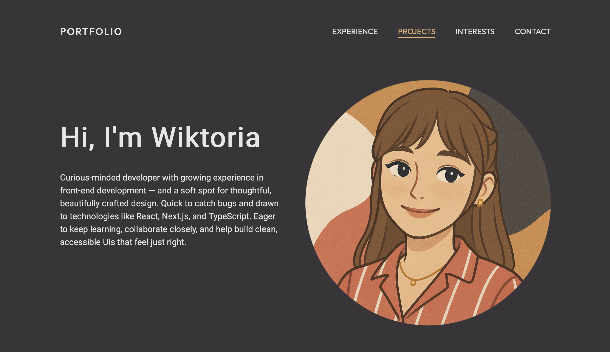
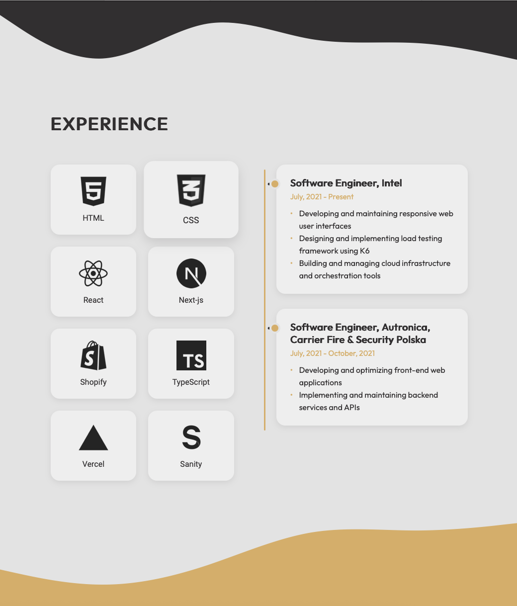
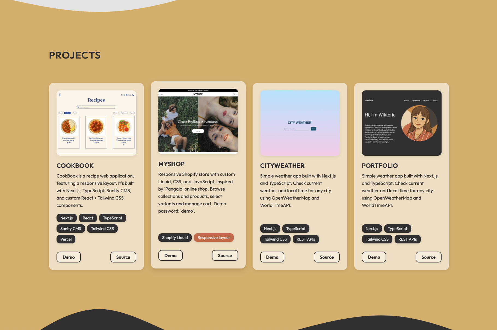
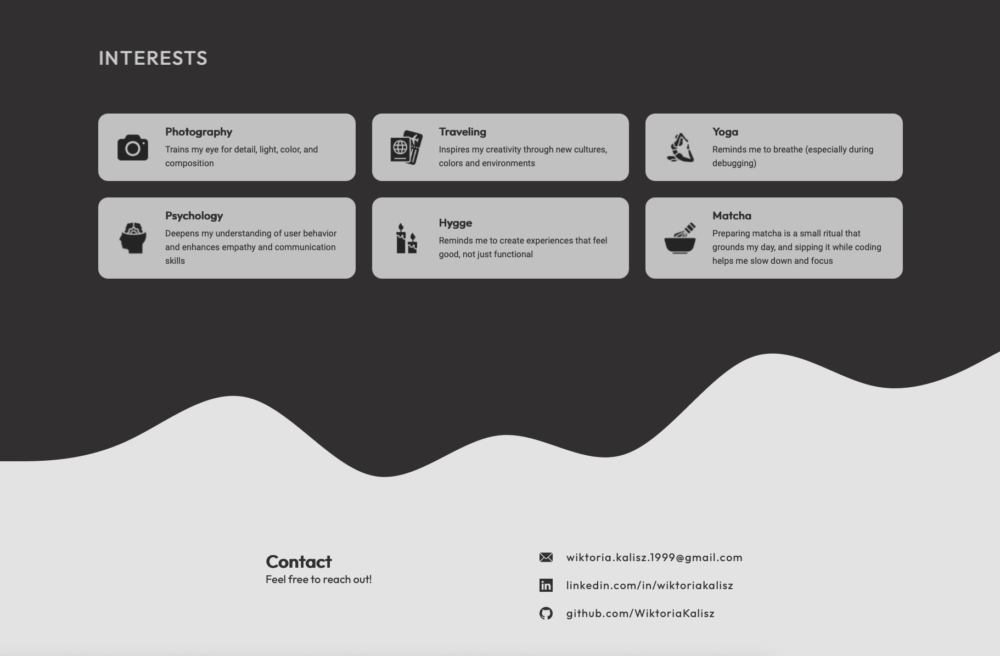
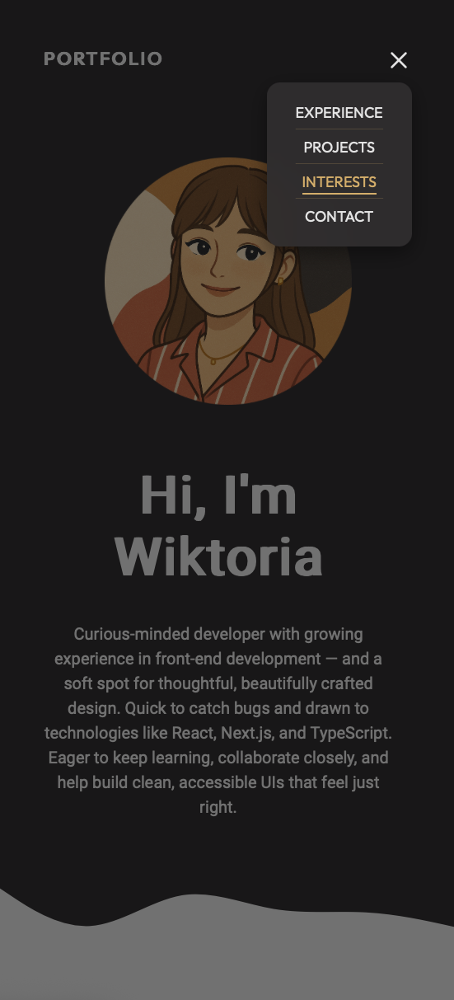

# React + Vite

This template provides a minimal setup to get React working in Vite with HMR and some ESLint rules.

Currently, two official plugins are available:

- [@vitejs/plugin-react](https://github.com/vitejs/vite-plugin-react/blob/main/packages/plugin-react/README.md) uses [Babel](https://babeljs.io/) for Fast Refresh
- [@vitejs/plugin-react-swc](https://github.com/vitejs/vite-plugin-react-swc) uses [SWC](https://swc.rs/) for Fast Refresh

# Portfolio

Portfolio is a personal web application showcasing my professional experience, projects, and skills through a clean and responsive design.
It's built with Next.js, TypeScript, and custom React + Tailwind CSS components.

## Features

- Overview of professional experience, projects, and technologies
- Responsive design that adapts to any screen size
- Custom wave-shaped SVG section dividers for a visually cohesive layout
- Thoughtfully designed color palette limited to a few key tones for visual harmony and contrast

## Technologies Used

- **Next.js 13+ (App Router) with React components**
- **TypeScript for type safety and maintainability**
- **Tailwind CSS for responsive styling**
- **Vercel for deployment and hosting**

## Skills Demonstrated

- Building responsive and interactive UI with React and Tailwind CSS
- Structuring a scalable Next.js project with reusable components
- Designing custom SVG wave separators for seamless section flow
- Managing project data via reusable JSON structures
- Configuring and deploying a production-ready app on Vercel

## UX Principles Applied

The design of Portfolio incorporates few key UX principles to create an intuitive and user-friendly experience:

- **Aesthetic-Usability Effect**  
A minimal layout and a limited, warm color palette make the portfolio visually appealing and invite users to explore it intuitively.

- **Law of Similarity**  
Consistent styling of project cards, icons, and typography helps users instantly recognize related content and understand the site’s visual hierarchy.

- **Chunking**  
Information is organized into clearly separated sections — Experience, Projects, Interests and Contact — making the content easy to scan and digest at a glance.

- **Law of Proximity**  
Related details, such as project descriptions and technology stacks, are grouped closely together, helping users quickly identify meaningful connections.

## Run

Go to [https://portfolio-wiktoria-kalisz.vercel.app](https://portfolio-wiktoria-kalisz.vercel.app)
No password is required.

## Preview

