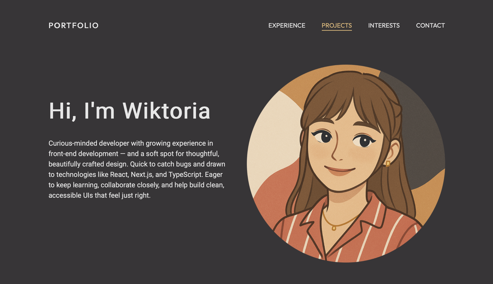
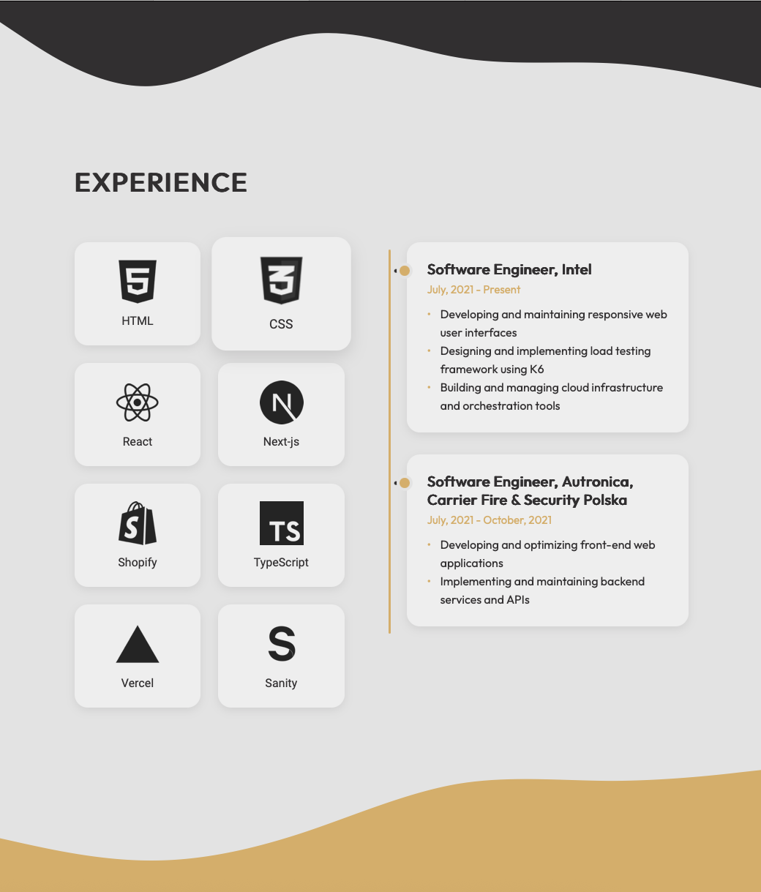
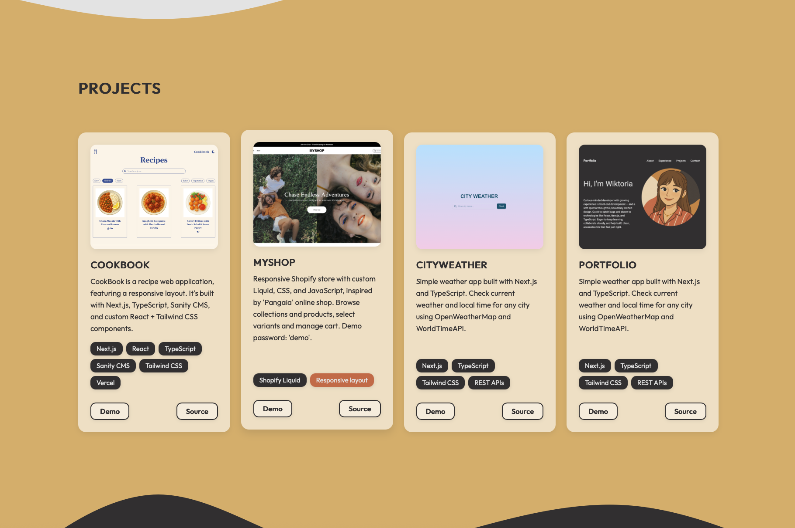
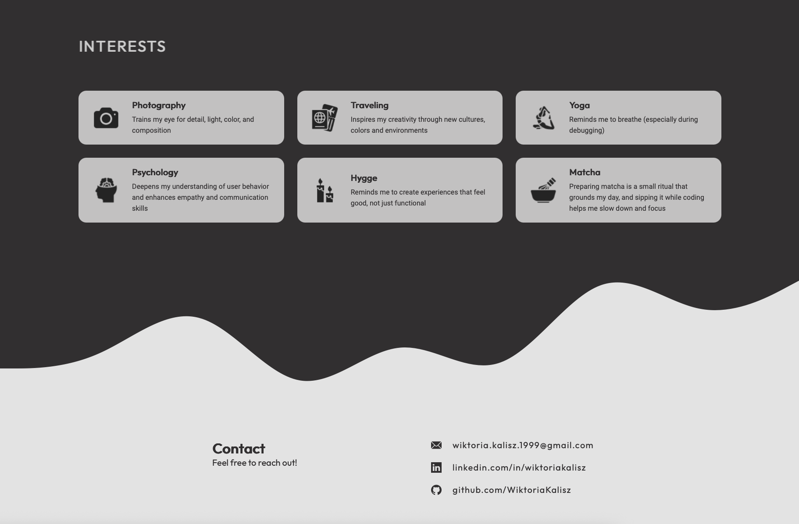
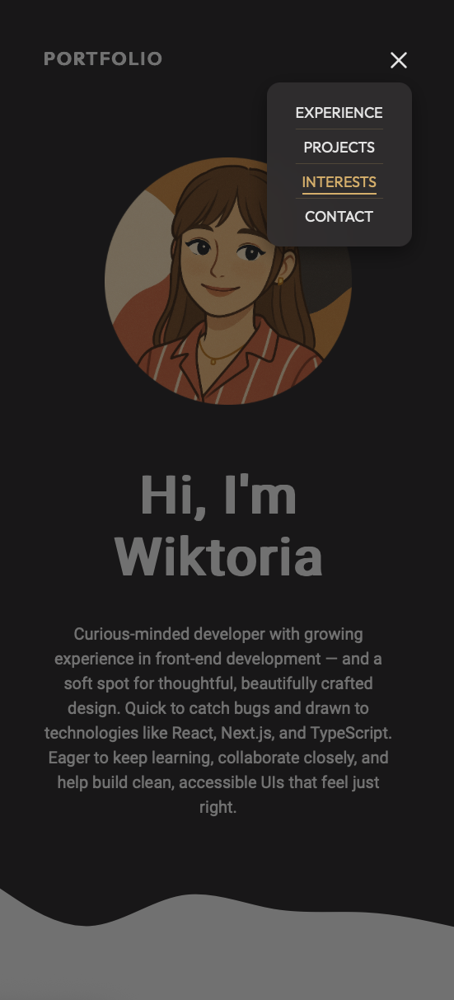

# Portfolio

Portfolio is a personal web application showcasing my professional experience, projects, and skills through a clean and responsive design.
It's built with Next.js, TypeScript, and custom React + Tailwind CSS components.

## Features

- Overview of professional experience, projects, and technologies
- Responsive design that adapts to any screen size
- Custom wave-shaped SVG section dividers for a visually cohesive layout
- Thoughtfully designed color palette limited to a few key tones for visual harmony and contrast

## Technologies Used

- **Next.js 13+ (App Router) with React components**
- **TypeScript for type safety and maintainability**
- **Tailwind CSS for responsive styling**
- **Vercel for deployment and hosting**
- **Jest for unit testing**  
- **Cypress for e2e testing**  
- **Docker for containerized builds**

## CICD

Portfolio uses a CI/CD pipeline to ensure reliable builds, tests, and deployments. The pipeline includes the following steps:
- **Code Quality & Linting**  
  - ESLint runs to check code style and potential errors
- **Unit & Integration Tests**  
  - Jest runs unit tests for React components, hooks, and utility functions
  - Test coverage is collected and saved as an artifact
- **End-to-End Tests**  
  - Cypress runs e2e tests simulating user interactions such as navigating sectionsand viewing projects
- **Build & Packaging**
  - On the main branch, successful builds are packaged into Docker images and pushed to DockerHub.
- **Deployment**  
  - Automatic deployment to Vercel ensures the live app stays up-to-date

## Testing

### Jest
- Unit tests cover React components, hooks, and utility functions 
- Test coverage is **~72% statements, ~80% branches, ~69% functions, ~76% lines**, ensuring core functionality is verified
- Coverage reports are generated in HTML and uploaded as CI artifacts for monitoring code quality

### Cypress
- End-to-end tests simulate real user flows:  
  - Browsing portfolio sections (Experience, Projects, Interests, Contact)  
  - Viewing project details  
  - Interacting with responsive UI components  
- Ensures that workflows and responsive behaviors work correctly

## Skills Demonstrated

- Building responsive and interactive UI with React and Tailwind CSS
- Structuring a scalable Next.js project with reusable components
- Designing custom SVG wave separators for seamless section flow
- Managing project data via reusable JSON structures
- Configuring and deploying a production-ready app on Vercel
- Setting up CI/CD pipeline with GitHub Actions to automatically lint, run unit and e2e tests, collect coverage and deploy builds to Vercel
- Writing unit tests with Jest and generating coverage reports
- Writing end-to-end tests with Cypress to simulate real user interactions
- Managing test artifacts by uploading coverage reports for monitoring code quality

## UX Principles Applied

The design of Portfolio incorporates few key UX principles to create an intuitive and user-friendly experience:

- **Aesthetic-Usability Effect**  
A minimal layout and a limited, warm color palette make the portfolio visually appealing and invite users to explore it intuitively.

- **Law of Similarity**  
Consistent styling of project cards, icons, and typography helps users instantly recognize related content and understand the site’s visual hierarchy.

- **Chunking**  
Information is organized into clearly separated sections — Experience, Projects, Interests and Contact — making the content easy to scan and digest at a glance.

- **Law of Proximity**  
Related details, such as project descriptions and technology stacks, are grouped closely together, helping users quickly identify meaningful connections.

## Run

Go to [https://portfolio-wiktoria-kalisz.vercel.app](https://portfolio-wiktoria-kalisz.vercel.app)
No password is required.

## Preview

